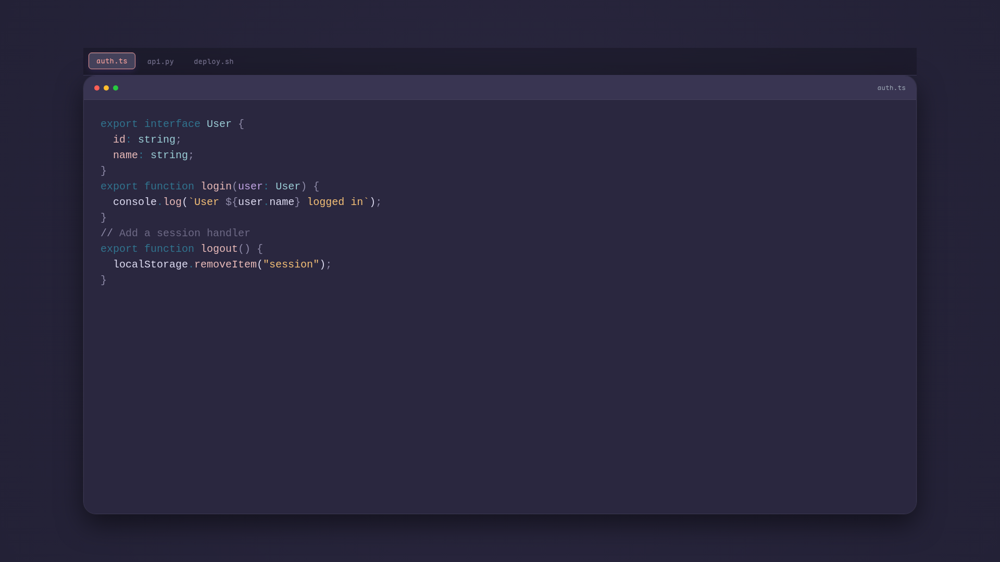

# Snipcast 🎥


[View Demo Video](./example/preview.mp4)

Turn your Markdown snippets into beautiful, animated code-typing videos. Perfect for tutorials, showcases, and social media.

## Features

- **Multi-file Support**: Transition smoothly between different files.
- **Dynamic Languages**: Supports any language via Shiki highlighting.
- **Custom Themes**: Inject your own CSS via a special `_theme.css` block.
- **Intelligent Appends**: Multiple blocks for the same file are typed sequentially (with smart newline handling).
- **Video & Static Images**: Export high-quality MP4s or static PNG snapshots.

## Usage

```bash
# Install globally
npm install -g snipcast

# Render a video
snipcast tutorial.md

# Render a static image of the final state
snipcast tutorial.md --image
```

## The "Special" Markdown

Snipcast uses standard Markdown with some flavor in the code block metadata:

### Filenames and Transitions
Define the file being typed with `filename=...`.

````markdown
```typescript filename=index.ts
console.log("Hello!");
```

```python filename=utils.py
print("Hi from Python!")
```
````

### Highlighting Lines
Focus the viewer's attention on specific lines.

````markdown
```typescript filename=api.ts highlight={2,4-6}
const app = new App();
// This line and the ones below will be highlighted
app.start();
```
````

### Appending Code
If you use the same `filename` in multiple blocks, Snipcast will type the new content directly below the previous one. If the second block *starts* with the content of the first, it will intelligently avoid duplication.

### Custom Themes
The most powerful feature. Add a code block with `filename=_theme.css` to override any visual aspect:

````markdown
```css filename=_theme.css
.cc-card {
  border: 2px solid #ea9a97 !important;
  border-radius: 40px !important;
}

.cc-container {
  background: radial-gradient(circle, #232136 0%, #191724 100%) !important;
}
```
````

Available CSS classes:
- `.cc-container`: The main background area.
- `.cc-card`: The code editor container.
- `.cc-header`: Top bar with buttons and title.
- `.cc-tab-bar`: The file tabs container.
- `.cc-tab` & `.cc-tab-active`: Individual file tabs.
- `.cc-code-line` & `.cc-highlight-line`: Line-level styling.

## Options

- `--out, -o`: Specify output path.
- `--fps`: Frames per second (default: 30).
- `--cps`: Characters typed per second (default: 60).
- `--theme`: Syntax highlighting theme (e.g., `rose-pine`, `github-dark`).
- `--image`: Render a still image instead of a video.
- `--browser-executable`: Use a specific Chrome/Chromium path for rendering.

---
Built with [Remotion](https://remotion.dev) and [Shiki](https://shiki.style).
